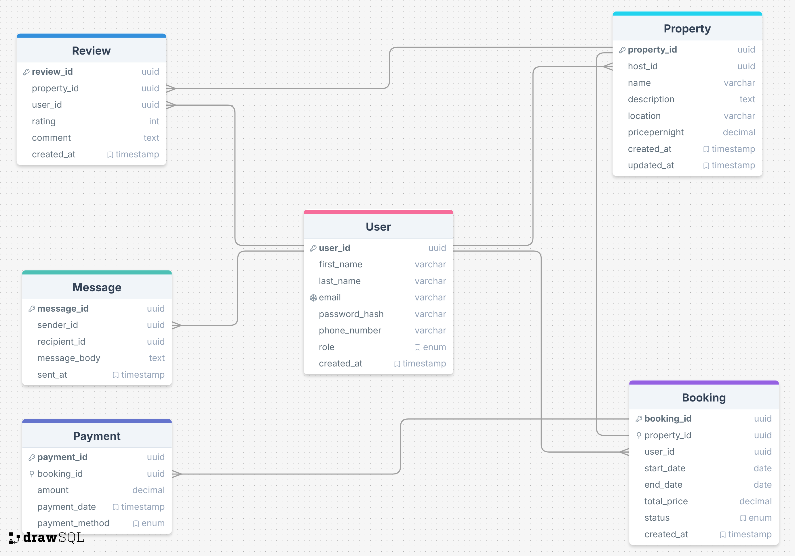

# Airbnb Clone Database Design

## Overview

# Entity Relationship Diagram

## 1. Entities and Attributes

### 🧑 User

* `user_id`: UUID, Primary Key, Indexed
* `first_name`: VARCHAR, NOT NULL
* `last_name`: VARCHAR, NOT NULL
* `email`: VARCHAR, UNIQUE, NOT NULL
* `password_hash`: VARCHAR, NOT NULL
* `phone_number`: VARCHAR, NULL
* `role`: ENUM (`guest`, `host`, `admin`), NOT NULL
* `created_at`: TIMESTAMP, DEFAULT `CURRENT_TIMESTAMP`

### 🏠 Property

* `property_id`: UUID, Primary Key, Indexed
* `host_id`: UUID, Foreign Key → User(`user_id`)
* `name`: VARCHAR, NOT NULL
* `description`: TEXT, NOT NULL
* `location`: VARCHAR, NOT NULL
* `pricepernight`: DECIMAL, NOT NULL
* `created_at`: TIMESTAMP, DEFAULT `CURRENT_TIMESTAMP`
* `updated_at`: TIMESTAMP, ON UPDATE `CURRENT_TIMESTAMP`

### 📅 Booking

* `booking_id`: UUID, Primary Key, Indexed
* `property_id`: UUID, Foreign Key → Property(`property_id`)
* `user_id`: UUID, Foreign Key → User(`user_id`)
* `start_date`: DATE, NOT NULL
* `end_date`: DATE, NOT NULL
* `total_price`: DECIMAL, NOT NULL
* `status`: ENUM (`pending`, `confirmed`, `canceled`), NOT NULL
* `created_at`: TIMESTAMP, DEFAULT `CURRENT_TIMESTAMP`

### 💳 Payment

* `payment_id`: UUID, Primary Key, Indexed
* `booking_id`: UUID, Foreign Key → Booking(`booking_id`)
* `amount`: DECIMAL, NOT NULL
* `payment_date`: TIMESTAMP, DEFAULT `CURRENT_TIMESTAMP`
* `payment_method`: ENUM (`credit_card`, `paypal`, `stripe`), NOT NULL

### ⭐ Review

* `review_id`: UUID, Primary Key, Indexed
* `property_id`: UUID, Foreign Key → Property(`property_id`)
* `user_id`: UUID, Foreign Key → User(`user_id`)
* `rating`: INTEGER, CHECK rating BETWEEN 1 AND 5, NOT NULL
* `comment`: TEXT, NOT NULL
* `created_at`: TIMESTAMP, DEFAULT `CURRENT_TIMESTAMP`

### ✉️ Message

* `message_id`: UUID, Primary Key, Indexed
* `sender_id`: UUID, Foreign Key → User(`user_id`)
* `recipient_id`: UUID, Foreign Key → User(`user_id`)
* `message_body`: TEXT, NOT NULL
* `sent_at`: TIMESTAMP, DEFAULT `CURRENT_TIMESTAMP`

---

## 2. Constraints

### User Table

* Unique constraint on `email`
* NOT NULL constraints on required fields

### Property Table

* Foreign key constraint on `host_id`
* NOT NULL constraints on essential attributes

### Booking Table

* Foreign key constraints on `property_id` and `user_id`
* `status` must be one of: `pending`, `confirmed`, `canceled`

### Payment Table

* Foreign key constraint on `booking_id`

### Review Table

* `rating` must be an integer between 1 and 5
* Foreign key constraints on `property_id` and `user_id`

### Message Table

* Foreign key constraints on `sender_id` and `recipient_id`

---

## 3. Indexing

### Automatically Indexed

* All Primary Keys

### Additional Indexes

* `email` in User table
* `property_id` in Property and Booking tables
* `booking_id` in Booking and Payment tables

---
